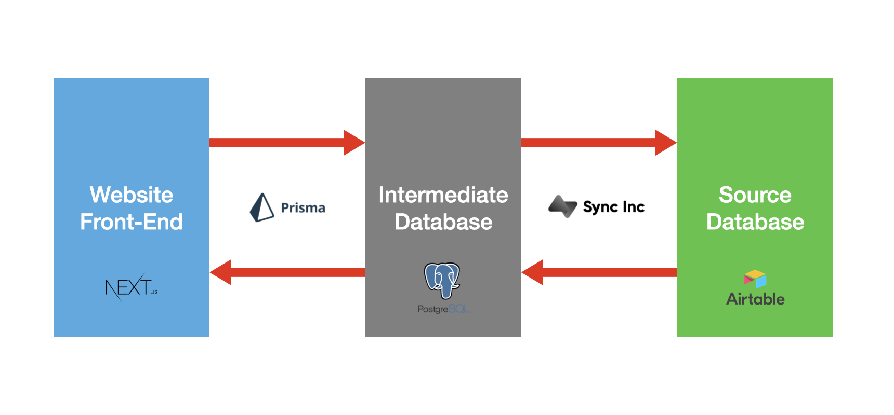

# Mutual Aid NYC Services List
A [Next.js](https://nextjs.org) website for displaying NYC health, human and social services lists in the [Open Referral](https://openreferral.org) data format. Data is managed via [Airtable](https://airtable.com).

## Technical Overview
As of our most recent design, the major components and technologies are as follows: 
* Website Front-End
  * Uses Next JS and houses most (if not all) critical logic for fetching and displaying list data from the Intermediate Database. 
* Intermediate Database
  * Uses Postgress SQL and is provisioned by Sync Inc service for Airtable. Read-only(?) and is queried by the Front-End to avoid the Airtable API Query limits. 
* Source Database
  * An existing and continuously updated Airtable. Sync Inc will push updated to Intermediate Database. Any writes should be done manually via Airtable UI atm. 

## Tech Stack
- [TypeScript](https://www.typescriptlang.org)
- [Chakra UI](https://chakra-ui.com) 
- [Prisma](https://www.prisma.io/) (?)
- [PostgresSQL](https://www.postgresql.org/)
- [Sync Inc](https://syncinc.so/)
- [Airtable](https://airtable.com)

## Requirements
- [Node.js](https://nodejs.org/en/)
- [Yarn 1](https://classic.yarnpkg.com/lang/en/)

## Running Locally
- Copy this repo: `git clone https://github.com/MutualAidNYC/services-lists.git`
- Install the Yarn package manager (version 1): `npm install -global yarn`
- Install dependencies: `yarn install`
- Copy the `sample.env` file: `cp sample.env .env.local`
- Add your Airtable API key and the id of the Airtable base containing your data to the `.env.local` file.
- Start a development server: `npm run dev`
- View the site locally at http://localhost:3000/

## Running with Docker
- Build docker image from main directory: `docker build -t services-lists-docker . `
- Run created image: `docker run -p 3000:3000 services-lists-docker`
